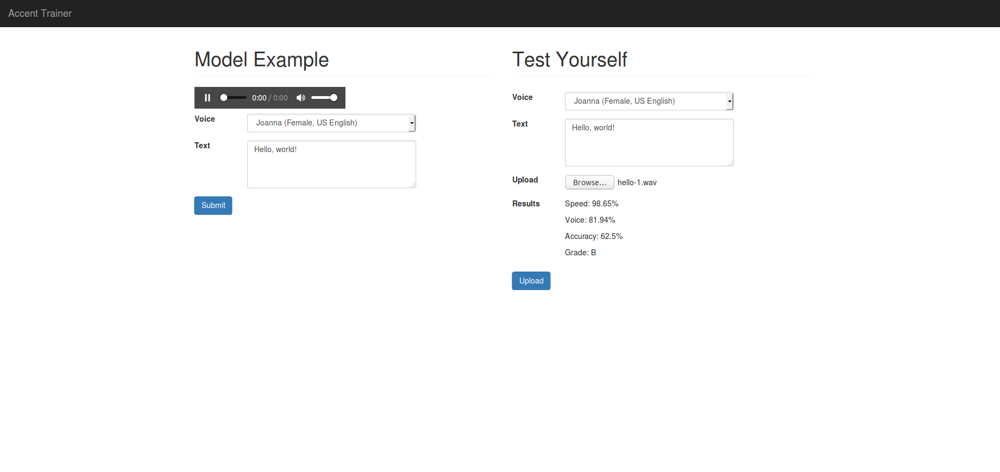

# Accent Trainer
Accent Trainer is Flask webapp/endpoint that compares the user's speech with different accents and assigns similarity scores based on speed, voice (DTW/MFCC), and accuracy. The accents are generated from Amazon Polly and accuracy analysis using Bing Speech API speech to text.

## Installation
1. Install [Anaconda](https://docs.continuum.io/anaconda/install) for Python 3.6. If space is a problem, you can also use pip or Miniconda to install the dependencies.
2. `git clone` the repository and `cd` into it.
3. You may then choose to install the rest of the dependencies in a virtual environment or not (as well as the pip or conda method).
⋅⋅1. `conda install -c conda-forge librosa`
⋅⋅2. `pip install pysoundfile`
⋅⋅3. `pip install SpeechRecognition`
⋅⋅4. `pip install python_speech_features`
⋅⋅5. `pip install cydtw`
⋅⋅6. `pip install Flask-WTF`
⋅⋅5. `pip install Flask-WTF`
4. Register for Amazon Web Services, [install](http://docs.aws.amazon.com/cli/latest/userguide/installing.html) the CLI and [configure](http://docs.aws.amazon.com/cli/latest/userguide/cli-chap-getting-started.html) it. You might allneed to `pip install boto3`.
5. Register for Microsoft Azure and get a Bing Speech API key. Insert it into `BING_KEY` in `functions.py`.
6. Write your own secret key in `app.secret_key` in `app.py`
7. `python app.py`

## Contributing
Feel free to post issues and make pull requests.

## Hiring
This is a skeleton for a more fully developed server-side solution. Feel free to contact me for a private implementation via my [website](https://www.pinewebarchitects.com/).